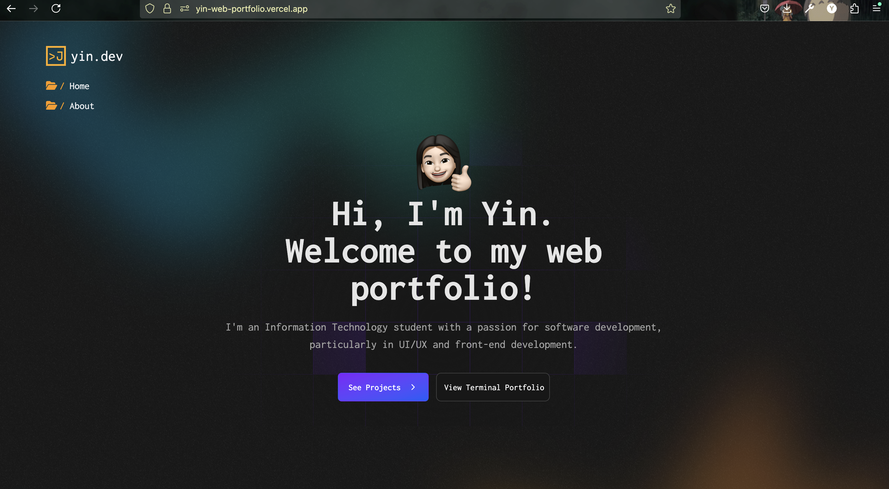
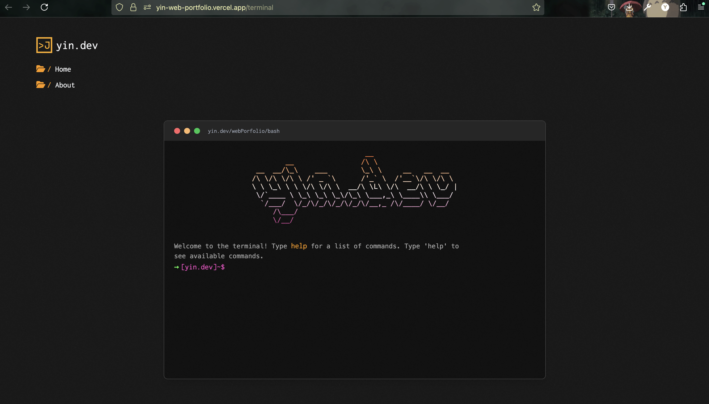

# 👾 First Open Source Web Portfolio

Welcome to my simple website portfolio!

# ↝ Project Overview

This portfolio was basically created to explore and deepen my understanding of **Vue.js (with Vite)** and **Tailwind CSS**.

# ↝ Tech Stack

- **Frontend:** Vue.js (with Vite), and Tailwind CSS
- **Design:** Figma
- **Other Tools:** npm and Git

# ↝ Features

- Terminal Inspired Portfolio ㅤ🦦
- Responsive Design (still buggy in some parts)
- Interactive animations (powered by AOS and custom hover effects)
- Dynamic project showcase
- Smooth page transitions

# Highlights

Landing Page

My Terminal Portfolio

# ↝ Rooms for Improvement
- Implement a backend using **Laravel** or **Node.js** for dynamic data handling.
- Implement lazy loading for offscreen content.
- Follow best practices for **Vue 3 Composition API** structure.
- Add a **light mode 𖤓** for better user experience.
- Add exitable tabs in Terminal

Feel free to explore, contribute, or get inspired!
